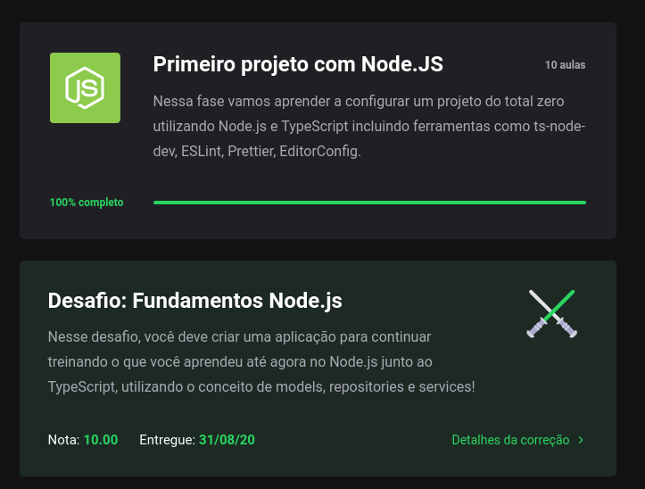
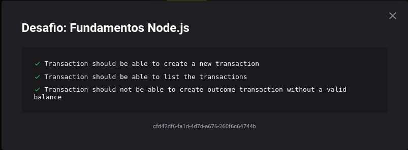

<h1 align="center">
  Desafio 05: Primeiro projeto Node.js
</h1>

<blockquote align="center">“Para quem fica melhor a cada dia, ficar pronto é utopia”!</blockquote>

## Sobre o desafio 💪
Mais um desafio do GoStack 13.0! 🚀  
Esse módulo, começamos a fazer nossos primeiros projetos do zero no GoStack, deu para aprender muito nesse último módulo, 
aprendemos a deixar nosso código mais legível e bem formato com o ESLint,Prettier e o EditorConfig. E ainda vimos sobre princípios SOLID e sobre arquitetura de softwares e patterns. 📈  
Foi usado o Jest (uma estrutura de testes criada pelo Facebook) para realizar os testes e ver se passamos no desafio, os testes eram os seguintes 🛠  
</img>  
Para mais detalhes sobre o desafio e que era precisa ser feito para ser passado em cada teste, você pode ver neste <a href="https://github.com/rocketseat-education/bootcamp-gostack-desafios/tree/master/desafio-fundamentos-nodejs">link</a>.

## 3/3 Testes Concluído 🎯
Consegui passar no teste, e isso me garantiu uma nota 10.00 nesse desafio. 😀
</img>
